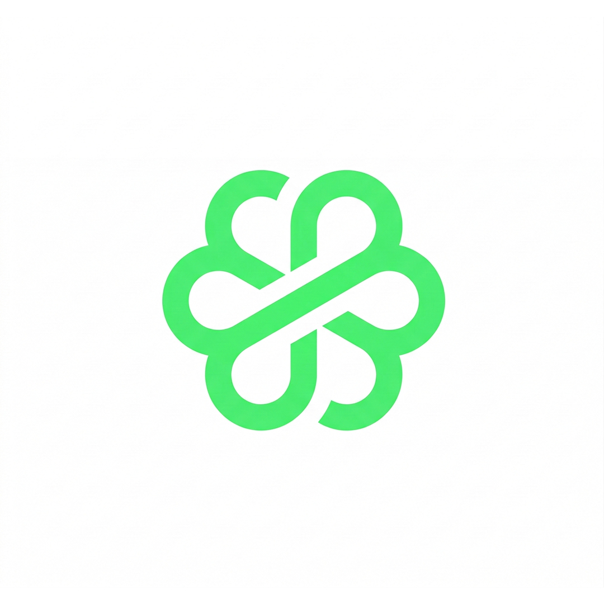

# 🍏 TenderApp - Gestión Inteligente para tu Negocio

> ### ⚠️ AVISO DE PROPIEDAD INTELECTUAL
> **PROYECTO PRIVADO Y PROPIETARIO.** 
> Queda estrictamente prohibida la copia, reproducción, distribución, modificación o uso comercial de cualquier parte de este código fuente, activos o documentación sin la autorización expresa y por escrito del autor. 
> **Todos los derechos reservados © 2026.**

---

TenderApp es una solución integral de punto de venta (POS) e inventario diseñada para optimizar la administración de pequeños y medianos comercios. Enfocada en la eficiencia y la facilidad de uso, permite gestionar ventas, stock por lotes (FEFO), clientes, proveedores y finanzas desde una interfaz moderna y profesional.



## 🚀 Funcionalidades Clave (Resumen Ejecutivo)

*   **Punto de Venta (POS) Avanzado:** Realiza ventas rápidas, aplica descuentos y gestiona créditos (fiar) a clientes.
*   **Gestión de Inventario por Lotes (FEFO):** Algoritmo automático para priorizar la salida de productos según su fecha de vencimiento (First-Expired, First-Out).
*   **Dashboard Financiero:** Visualiza tus ingresos, egresos y utilidad neta (Ventas - Gastos) en tiempo real.
*   **Fidelización de Clientes:** Sistema nativo de puntos acumulables por compras para canjes y descuentos.
*   **Reportes Profesionales:** Exporta tus estadísticas de ventas y movimientos a formatos **PDF** y **Excel (.xlsx)**.
*   **Alertas Inteligentes:** Notificaciones automáticas para productos con stock bajo o próximos a vencer.

## 🎨 Diseño y UX

La aplicación utiliza una paleta de colores corporativa moderna:
- **Verde Bosque (#1A3C2B):** Elegancia y confianza en cabeceras.
- **Verde Neón (#00DF82):** Energía en botones de acción principal.
- **Material 3:** Navegación fluida y componentes visuales actualizados.

## 🛠️ Stack Tecnológico

*   **Framework:** [Flutter](https://flutter.dev/) (SDK >=3.0.0)
*   **Base de Datos:** SQLite (sqflite) con soporte para Desktop (FFI).
*   **Gestión de Estado:** Provider.
*   **Generación de Archivos:** PDF, Printing y Excel.

## 📥 Información para Desarrolladores (Uso Autorizado)

Este repositorio contiene la arquitectura completa en Flutter. Para ejecutar el entorno de desarrollo bajo licencia:

1.  **Instalación:**
    ```bash
    flutter pub get
    ```
2.  **Ejecución:**
    ```bash
    flutter run
    ```

---

## 📦 Guía de Lanzamiento (Release)

Para generar el instalador final para uso interno o comercial:

### 1. Preparación del Build
Asegúrate de haber incrementado la versión en `pubspec.yaml` (ej. `version: 1.0.1+2`).

### 2. Generar el APK (Android)
Ejecuta el siguiente comando para obtener un instalador optimizado:
```bash
flutter build apk --release --split-per-abi
```
El archivo se encontrará en: `build/app/outputs/flutter-apk/app-release.apk`.

### 3. Generar para Desktop (Windows)
```bash
flutter build windows
```

---

## 🚫 Restricciones de Uso y Licencia

1.  **No Distribución:** No se permite subir este código a repositorios públicos o foros sin autorización.
2.  **No Ingeniería Inversa:** Queda prohibido el desensamblado del binario final para fines competitivos.
3.  **Uso Comercial:** El uso comercial de esta plataforma requiere una licencia activa otorgada por el propietario.

## 📞 Contacto y Licencias

Si estás interesado en adquirir una licencia de uso o personalización de **TenderApp**, por favor contacta al administrador del proyecto.

---
*Desarrollado con pasión para la eficiencia comercial.*
